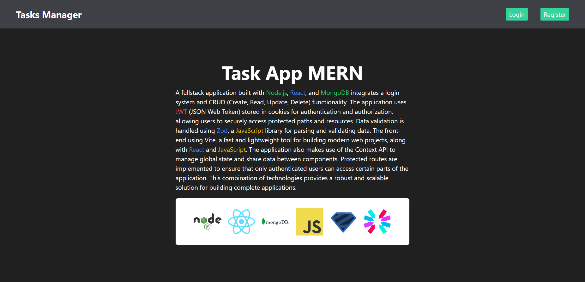

# Nodejs React Mongodb Login y CRUD (Aplicación FullStack)

Este es un proyecto creado con Nodejs React Mongodb

## Screenshots



## Instalación

Instala usando npm

1. Clona el repositorio.
2. Ejecuta `npm install` para instalar las dependencias.
3. Ejecuta `npm run dev` para iniciar el servidor de desarrollo.
4. Ejecuta `cd client` seguido de `npm run dev` para iniciar la aplicación.

```bash
npm run dev
# or
yarn dev
# or
pnpm dev
```

## Características

- Vite + React para el marco de trabajo de React.
- TailwindCSS para el diseño y estilos.
- MongoDB para la base de datos.
- JWT para la autenticación.
- useContext para la gestión del estado.

Abre [http://localhost:3000](http://localhost:3000) con tu navegador para ver el resultado de la API.

Abre [http://localhost:5173](http://localhost:5173) con tu navegador para ver el resultado de la Aplicación.

## Aprende más

Para aprender más sobre Next.js, echa un vistazo a los siguientes recursos:

- [Documentación de Vite](https://vitejs.dev/guide/) - aprende sobre las características de Vitejs.
